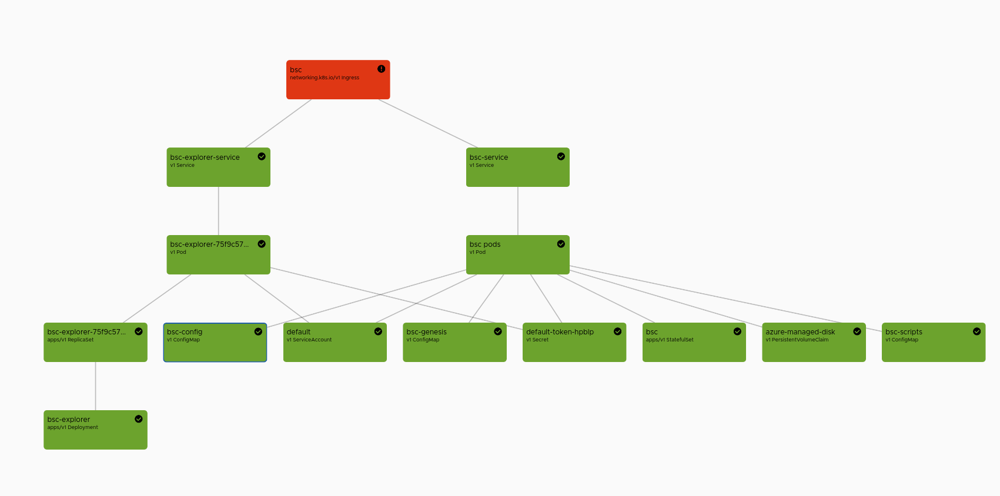
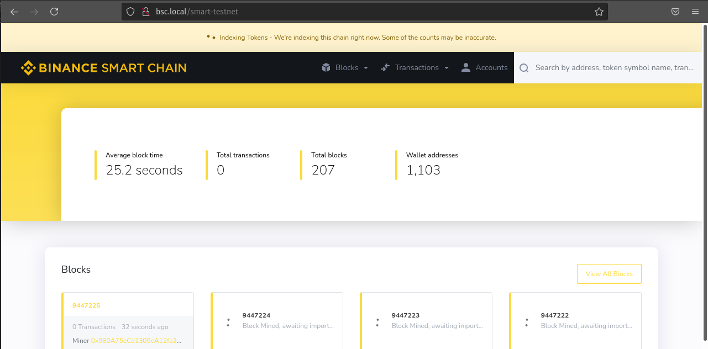
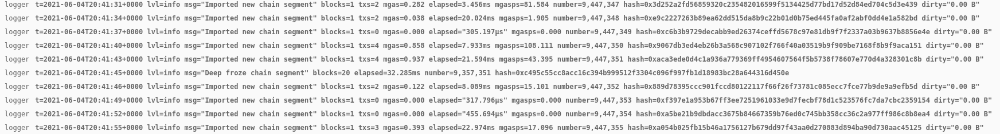
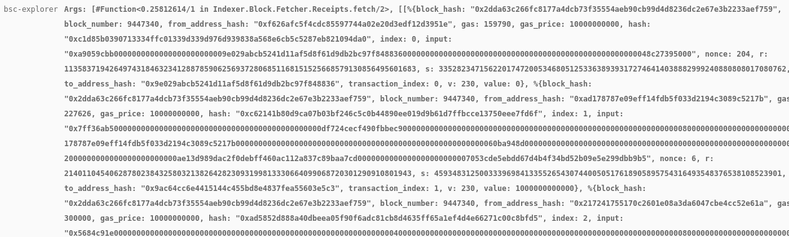

# Binance Smart Chain Node + Blockscout
## Introduction


This repository holds consists out of few parts.
- `/iac`: The infrastructure as code terraform configuration to setup a Kubernetes cluster on Azure. An AKS cluster with the following is deployed by default:
  - A default node pool with three `Standard_DS2_v2` nodes.
  - Kubernetes v1.19.11
- `/charts`: A helm chart to deloy both [Binance Smart Chain](https://github.com/binance-chain/bsc) Node and a [Blockscout explorer](https://github.com/binance-chain/bsc-explorer)
  - This chart deploys the following items 
    

## Deployment
### Prerequisites

You must install the following locally to set everything up. When using an existing Kubernetes, you do not need `Terraform` and `AzureCli`

- [Terraform](https://www.terraform.io/downloads.html)
- [AzureCli](https://docs.microsoft.com/en-us/cli/azure/install-azure-cli)
- [Helm](https://helm.sh/docs/intro/install/)
- [Kubectl](https://kubernetes.io/docs/tasks/tools/)

**Optional:**
  - [Octant](https://octant.dev/): A useful Kubernetes UI Dashboard


### Deploying infrastructure on Azure

> This step is not required if you are using an existing Kubernetes cluster.

Make sure you learn some of the basics of Terraform before continuing.
1. Login to azure with `az login -t <your-tenant-id>` and set your subscription if necessary (`az account set -s <subscription-id>`)
2. Run the following script with bash: `iac/scripts/make-container.sh`.
   This script will deploy the base resources on Azure, required for holding the terraform state. You can find more info [here](https://docs.microsoft.com/en-us/azure/developer/terraform/store-state-in-azure-storage).
3. Navigate to the iac folder with your terminal
    1. Run `terraform init`
    2. Run `terraform apply` and agree to deploying the new resources.
4. When it is finished, make sure to run the following to import the kubeconfig to your local machine. \
  `az aks get-credentials --resource-group rg-3fd118jc --name aks-weu-tst-aks`

### Deploying the Helm Chart
Note: If you are not using azure, make sure to first set the variable `persistence.azure` to false in `/charts/values.yaml`. This will allow you to use the local disk for the node storage.

**Postgres**

First, you will need [Postgres](https://www.postgresql.org/). This is required for the Blockscout explorer.

In your terminal run the following commands:
```bash
helm repo add cetic https://cetic.github.io/helm-charts
helm repo update
helm install --name postgres cetic/postgresql
```

**Ingress Controller**

For our Ingress, we need an Ingress Controller in our cluster. 

> Skip this step if you already have one.

If you need one, run the following commands


```bash
kubectl create namespace ingress-basic
helm repo add ingress-nginx https://kubernetes.github.io/ingress-nginx
helm install nginx-ingress ingress-nginx/ingress-nginx \
    --namespace ingress-basic \
    --set controller.replicaCount=2 \
    --set controller.nodeSelector."beta\.kubernetes\.io/os"=linux \
    --set defaultBackend.nodeSelector."beta\.kubernetes\.io/os"=linux \
    --set controller.admissionWebhooks.patch.nodeSelector."beta\.kubernetes\.io/os"=linux
```

**Installing the BSC node and Blockscout Explorer**

1. Go in the charts folder
2. In the `values.yaml` file make sure `init_genesis` is set to `true`. This is necessary to generate the genesis.
3. Run `helm install bsc ./bsc`
4. Set `init_genesis` to false in the `/charts/values.yaml` file for the future
5. Your done! Check the state with `kubectl get pods` or check in [Octant](https://octant.dev/)


### Browsing to the Explorer

There are two main ways to connect to the explorer. You can use the *Ingress* (recommended) or use local **port forwarding**.

#### Ingress

Our helm chart created an Ingress which listens on request made to bsc.local. To make sure we can connect to the ingress, you must change your host file so that request made to bsc.local will go to the ingress.

1. Get the public ip of the ingress with 

  ```bash
  kubectl get ingress -o jsonpath="{ .items[0].status.loadBalancer.ingress[0].ip 
  ```
2. [Add this line to your host file](https://www.howtogeek.com/howto/27350/beginner-geek-how-to-edit-your-hosts-file/). Replace `IP` with your actual IP returned from the previous command.

   `IP bsc.local`

3. Open your browser and go to `http://bsc.local/smart-testnet`. 
  You should see a basic authentication popup. The default username is `bsc` and the password is also `bsc`.
  > If the page does not load, try another browser. Some browsers ignore the hosts file.


You should see a webpage looking like this:



#### Port Forwarding  

You can also use local port forwarding to skip the ingress and connect directly with the pod.

Enter the following command
```bash
kubectl port-forward --namespace default $(kubectl get pods --namespace default -l "app.kubernetes.io/name=bsc-explorer" -o jsonpath="{ .items[0].metadata.name }") 4000
```
Now open the browser and go to `http://localhost:4000/smart-testnet`


### Connecting to the Node

To connect to bsc RPC you can use the same methods as above.
All endpoints are secured with basic authentication.
The ingress exposes the following endpoints:

- `bsc.local/jsonhttp`: The RPC endpoint of the BSC Node.
   You can test this endpoint with: 
   ```bash
   curl -u bsc:bsc -k http://bsc.local/jsonhttp --data-binary '{"method":"web3_clientVersion","params":[],"id":1,"jsonrpc":"2.0"}' -H 'Content-Type: application/json'
   ```
   You should receive the following result
   ```json
   {"jsonrpc":"2.0","id":1,"result":"Geth/v1.1.0-beta-b67a129e-20210524/linux-amd64/go1.16.4"}
   ```
- `bsc.local/web-socket`: Websocket endpoint
- `bsc.local/p2p`: P2P endpoint

## Debugging !

If you want to check logs, execute the following
- For checking the BSC Node: `kubectl logs -f bsc-0 logger`
  
  You should get an output with import outputs 
  

- For checking the BSC Node: `kubectl logs -l "app.kubernetes.io/name=bsc-explorer" -f`
  
  You should get an output such as this
  

## Customize

You can customize both the Infrastructure as code and the helm chart.

### IaC Customizations

The AKS module is based on the [claranet module](https://github.com/claranet/terraform-azurerm-aks) with some adaptations to remove complexity. Many of the input variables can however be used to change the cluster configuration.

Check the `/iac/modules/variables.tf` file to see which parameters can be set. Add AKS customizations to this block.

```hcl
module "aks" {
  source              = "./modules/aks"
  resource_group_name = azurerm_resource_group.rg.name
  location            = var.location
  location_short      = var.location_short
  environment         = "tst"
  kubernetes_version = "1.19.11"

  ...add items here
}
```

### Helm Chart Customizations

All customizable options are in the `/charts/values.yaml` file.
When you changed something, run `helm upgrade bsc ./bsc` to deploy your changes.
